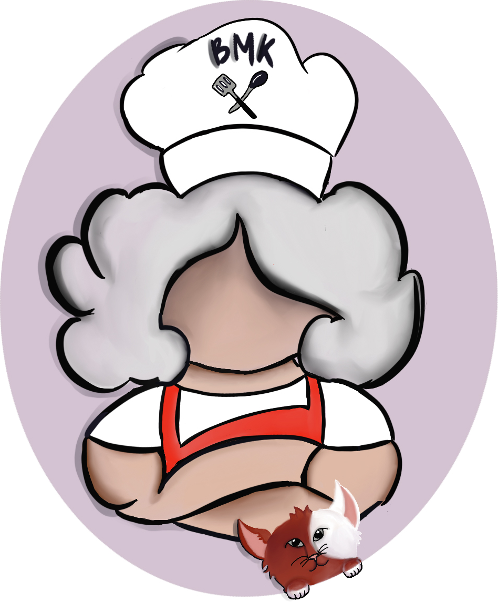

# BigMamasKitchen

<p align="center"></p>

## Introduction

Welcome to the Kitchen!! Big Mama is strong, bold, loves cute things (such as her cat, Katchup), and cultivates the most flavorful dishes for her consumers. After a few minutes in her kitchen your taste buds are sure to be left tingling. She will throw in a wide variety of flavors from spicy to sweet, from tangy to salty, and will always finish a job with a sassy wink. Better get your plates ready, are you ready for a taste?

This language is for people who love to cook as it uses cooking/baking phrases. BigMamasKitchen serves to spice up statically typed/scoped languages.

Cooked up by Bridget O'Connor, Sophia Mackin, Moriah Scott, Rachel Nguyen, Miliano Mikol.

Cooking Language

- variables can be ingredients
- loops can be things like stir or bake
- function can be like a recipe

## Features

- Statically typed with static scoping

- Data Structures like arrays and dictionaries

- Cooking keywords

- Emoji brackets

- Statements terminated with ;)

## Types:

| BigMamasKitchen | JavaScript |
| --------------- | ---------- |
| spicy           | Boolean    |
| bitter          | Number     |
| salty           | String     |

## Keywords Guide

| BigMamasKitchen | JavaScript      |
| --------------- | --------------- |
| cooked          | true            |
| raw             | false           |
| (^-^)~ ~(^-^)   | {}              |
| ;)              | ;               |
| until condition | (condition)     |
| ingredient      | let             |
| recipe          | func            |
| bland           | void            |
| stop            | break           |
| stir            | while           |
| bake            | for             |
| addAPinch       | if              |
| orSubstitute    | else if         |
| dumpLeftovers   | else            |
| rollOut...      | ...             |
| mamaSays("")    | console.log("") |
| null            | empty           |

**Note: After each statement please add the ;)**

## Function Declaration

```
recipe eggsBenedict (bitter eggWhites, sweet sauce) (^-^)~ ~(^-^)
```

## Variable Declaration and Assignment

### Declaration

```
ingredient bitter egg = 1 ;)
```

## Assignment

```
egg = 4 ;)
```

```
Array:

ingredient  rollCake = (@) (@)

Dictionary

ingredient = [#] [#]


```

## Control Flow

### If Statement

```
addAPinch until i < -35 (^-^)~

~(^-^) orSubstitute until i > 35 (^-^) ~

~(^-^) dumpLeftovers (^-^)~

~(^-^)
```

### While Loop

```
stir until cooked (^-^)~
~(^-^)

```

### For Loops

```
bake ingredient bitter egg = 1 until egg < 40 egg++ (^-^)~ ~(^-^)
```

## Comments

### Multi-line Comment:

```
--[=] Include more sugar [=]--
```

### Single-line Comment:

```
  ~(=^‥^) We love Big Mama
```

## Example Programs

### Hello, World!

<table>
  <tr>
  <th>BigMamasKitchen</th>
  <th>JavaScript</th>
  </tr>

  <tr>
  <td>

```
mamaSays "Hello world!" ;)
```

  </td>
  <td>

```JavaScript
console.log(“Hello world!”);
```

  </td>
  </tr>
</table>

### Sum of Two Numbers

<table>
  <tr>
  <th>BigMamasKitchen</th>
  <th>JavaScript</th>
  </tr>

  <tr>
  <td>

```
recipe bitter Add (bitter a, bitter b) (^-^)~
serve a + b ;)
~(^-^)
```

</td>
  <td>

```JavaScript
function Add (a, b) {
 return a + b;
 }
```

  </td>
  </tr>
</table>

## Even or Odd

<table>
  <tr>
  <th>BigMamasKitchen</th>
  <th>JavaScript</th>
  </tr>

  <tr>
  <td>

```
recipe bitter evenOdd (bitter a) (^-^)~
serve x % 2 == 0 ;)
~(^-^)

```

</td>
  <td>

```JavaScript
function evenOdd (a) {
    return a % 2 == 0;
}

```

  </td>
  </tr>
</table>

### Greatest Common Divisor

<table>
  <tr>
  <th>BigMamasKitchen</th>
  <th>JavaScript</th>
  </tr>

  <tr>
  <td>

```
recipe bitter gcd (bitter a, bitter b) (^-^)~
a = Math.abs(a) ;)
b = Msath.abs(b) ;)

addAPinch (b > a) (^-^)~
ingredient temp = a ;) a = b ;) b = temp ;)
~(^-^)
stir until cooked (^-^)~
addAPinch ( b == 0) serve a ;)
a %= b ;)
addAPinch ( a == 0) serve b ;)
b %= a;
~(^-^)


~(^-^)

```

</td>
  <td>

```JavaScript
function gcd(a,b) {
    a = Math.abs(a);
    b = Math.abs(b);
    if (b > a) {var temp = a; a = b; b = temp;}
    while (true) {
        if (b == 0) return a;
        a %= b;
        if (a == 0) return b;
        b %= a;
    }
}


```

  </td>
  </tr>
</table>

## Other Examples

<table>
  <tr>
  <th>BigMamasKitchen</th>
  <th>JavaScript</th>
  </tr>

  <tr>
  <td>

```
addAPinch until i < -35 (^-^)~
  mamaSays “too cold” ;)
~(^-^) or substitute until i > 35 (^-^) ~
  mamaSays “just right” ;)
~(^-^) dumpLeftovers (^-^)~
  mamaSays “try again!” ;)
~(^-^)
```

</td>
  <td>

```JavaScript
if (i < -35) {
console.log(“too cold”);
} else if (i > 35) {
console.log(“just right”);
} else {
console.log(“try again!”);
}

```

  </td>
  </tr>
</table>

<table>
  <tr>
  <th>BigMamasKitchen</th>
  <th>JavaScript</th>
  </tr>

  <tr>
  <td>

```
ingredient bitter temperature = 0 ;)
stir until cooked (^-^)~
  temperature++ ;)
  addAPinch until temperature == 360 (^-^)~
    stop ;)
  (^-^)~
(^-^)~
```

</td>
  <td>

```JavaScript

let temperature = 0
while (true) {
temperature++
if(temperature == 360){
break;
}
}

```

  </td>
  </tr>
</table>

## Ohm Examples

### Passing:

```

mamaSays 1+2*3 ;)

"oh no" ;)

mamaSays (  	123   ) ;)

mamaSays (2+4)*7 ;)

mamaSays 2 * 3 ;)

ingredient bitter g = 5 * 10 ;)

(@) 3, 4, 5 (@) ;)

8 * 9 + (9 - 5) ;)

bake ingredient bitter egg = 1 until egg < 40 egg++ (^-^)~
~(^-^)

serve a + b ;)

recipe bitter Add (bitter a, bitter b) (^-^)~
  serve a + b ;)
~(^-^)

ingredient spicy(@) rawEggs = (@) raw, raw (@) ;)

ingredient spicy(@)(@) boolArrArr = (@) (@)raw(@), (@)raw, cooked(@) (@) ;)

ingredient bitter[#][#] dictDict=
[#]
"key1" : [#] "inner1": 5[#] ,
"key2" : [#] "inner2": 2[#]
[#]  ;)

ingredient salty[#] basicDict = [#]  "key" : "value" [#]  ;)

```

### Failing:

```
ingredient bitter g = 5 * 10 ;);)

ingredient spicy(@) = (@) raw, raw (@) ;)

ingredient salty[#]  bad= [#] "key" [#] ;)

```
