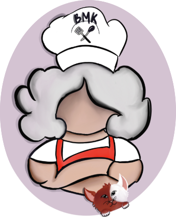

# BigMamasKitchen



## Introduction

Welcome to the Kitchen!! Big Mama is strong, bold, loves cute things (such as her cat, Katchup), and cultivates the most flavorful dishes for her consumers. After a few minutes in her kitchen your taste buds are sure to be left tingling. She will throw in a wide variety of flavors from spicy to sweet, from tangy to salty, and will always finish a job with a sassy wink. Better get your plates ready, are you ready for a taste?

This language is for people who love to cook as it uses cooking/baking phrases. BigMamasKitchen serves to spice up statically typed/scoped languages.

Cooked up by Bridget O'Connor, Sophia Mackin, Moriah Scott, Rachel Nguyen, Miliano Mikol.

Cooking Language

- variables can be ingredients
- loops can be things like stir or bake
- function can be like a recipe

## Features

- Statically typed with static scoping

- Data Structures like arrays and dictionaries

- Cooking keywords

- Emoji brackets

- Statements terminated with ;)

## Types:

| BigMamasKitchen | JavaScript |
| --------------- | ---------- |
| spicy           | Boolean    |
| bitter          | Number     |
| salty           | String     |

_Data Structure_

- Array - tangy
- Dictionary - sweet

## Keywords Guide

| BigMamasKitchen         | Other languages  |
| ----------------------- | ---------------- |
| cooked                  | true             |
| raw                     | false            |
| (^-^)~ ~(^-^)           | {}               |
| ;)                      | ;                |
| throw in param1, param2 | (param1, param2) |
| until condition         | (condition)      |
| cuisine ClassName       | class className  |
| chef                    | constructor      |
| recipe                  | func             |
| bland                   | void             |
| stop                    | break            |
| mama.says("")           | console.log("")  |

- Note: After each statement please add the ;)
- Note: caplitalize classNames

cuisine French

## Function Declaration

```
recipe eggs_benedict throw in bitter egg_whites, sweet sauce (^-^)~ ~(^-^)
```

## Variable Declaration and Assignment

### Declaration

```
ingredient bitter egg = 1 ;)
```

## Assignment

```
egg = 4 ;)
```

spread:
[ roll out... eggs ] ;)
array:
ingredient tangy roll_cake = [] this is an array

## Control Flow

### If Statement

```
Add a pinch until i < -35 (^-^)~

~(^-^) or substitute until i > 35 (^-^) ~

~(^-^) dump leftovers (^-^)~

~(^-^)
conditional starter is an until
```

### While Loop

```
stir until cooked (^-^)~
~(^-^)

- cooked is true
```

### For Loops

```
bake ingredient bitter egg = 1 until egg < 40 degrees 50++ (^-^)~ ~(^-^)
- degrees are optional, this is the increment
- degrees defaults to 1++
- ingredient must be initialized, so we initialize it here you could also do
ingredient bitter egg = 1
bake egg until egg > 500 (^-^)~ ~(^-^)
```

## Comments

### Multi-line Comment:

```
--[=] Include more sugar [=]--
```

### Single-line Comment:

```
  ~(=^‥^) i love big mama
```

Print statement:
BigMamasKitchen
mama.says("Hello world!") ;)

(31 pts) Complete the first pass of the design of the language that you will be writing a compiler for during this term. Give your language description on the README.md file of a public GitHub repository you will be setting up for the project. You should have, in your README:
A nice logo
The name of your language, in a large font (unless the language name is readable from the image)
BigMamasKitchen

A list of features
Statically typed, declare the type when adding in parameters or also when declaring new variables

## Example Programs

Lots of example programs. You can do the “your language on the left, JavaScript on the right” presentation style.

### Hello, World!

<table>
  <tr>
  <th>BigMamasKitchen</th>
  <th>JavaScript</th>
  </tr>

  <tr>
  <td>

```
mama.says("Hello world!") ;)
```

  </td>
  <td>

```JavaScript
console.log(“Hello world!”);
```

  </td>
  </tr>
</table>

### Sum of Two Numbers

<table>
  <tr>
  <th>BigMamasKitchen</th>
  <th>JavaScript</th>
  </tr>

  <tr>
  <td>

```
recipe bitter Add throw in bitter a, bitter b (^-^)~
serve a + b ;)
~(^-^)
```

</td>
  <td>

```JavaScript
function Add (a, b) {
 return a + b;
 }
```

  </td>
  </tr>
</table>

**these should be in conntrol flow i think**

Add a pinch until i < -35 (^-^)~
mama.says(“too cold”) ;)
~(^-^) or substitute until i > 35 (^-^) ~
mama.says(“just right”) ;)
~(^-^) dump leftovers (^-^)~
mama.says(“try again!”) ;)
~(^-^)

if (i < -35) {
console.log(“too cold”);
} else if (i > 35) {
console.log(“just right”);
} else {
console.log(“try again!”);
}

cuisine salty French (^-^)~
chef throw in salty spices, salty veggies (^-^)~
spices = spices ;)
veggies = veggies ;)
~(^-^)
~(^-^)
class French {
constructor(spices, veggies) {
this.spices = spices;
this.veggies = veggies;
}
}

ingredient bitter temperature = 0 ;)
stir until cooked (^-^)~
temperature++ ;)
add a pinch until temperature == 360 (^-^)~
stop ;)
(^-^)~
(^-^)~
let temperature = 0
while (true) {
temperature++
if(temperature == 360){
break;
}
}

```
BigMamasKitchen{

}
```
